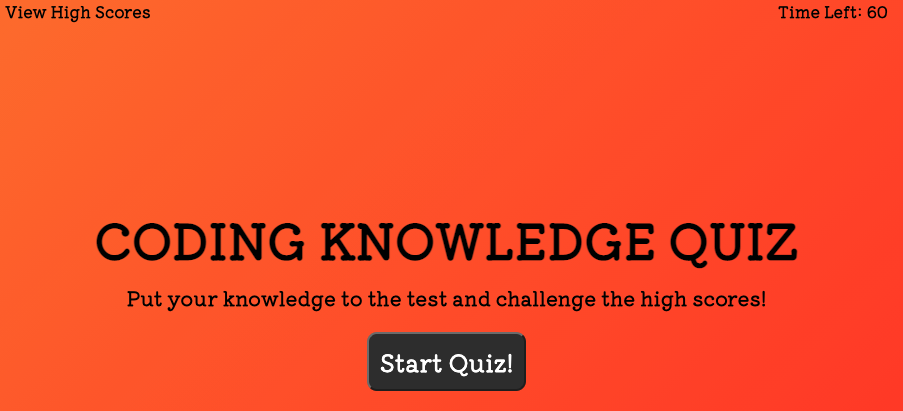

# Code Quiz

Link to live website: (https://https://abalcs.github.io/Code-Quiz/)

## Tech Used
HTML, CSS, JavaScript

## Instructions
To create a quiz that presents questions to the user, validates the correct answers, tally's their score, saves their initials input with their score to a list of high scores, and sets a 60 second timer to complete.

## Purpose
Memory recall with coding is an important way to learn and develop the skills needed.

## Directions
Click 'Start Quiz'

The user is presented with 5 questions, each containing 4 multiple choice answers.  Click the correct answer and the program will validate the response.  If correct, the program will award the user 10 points.  If incorrect, the program will deduct 10 seconds from the timer.

At the end of the questions the user will see his/her score total and can input their name/initials.  When he/she hits submit, the name and score will be added to the high scores.

## Issues
Could not figure out how to use local storage to keep the high scores on the page when the page is refreshed.  Aside from that all criteria are met.  Some general styling updates could be made but not critical to the acceptance criteria :)